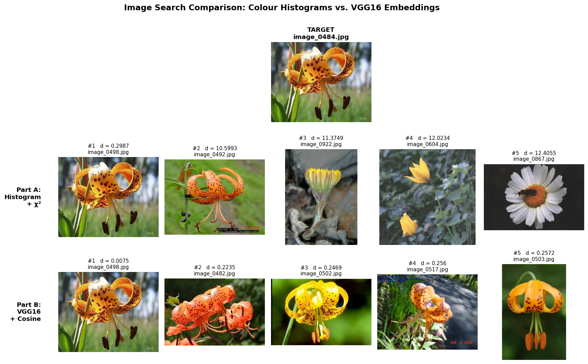

# Assignment 1 — Image Search: Colour Histograms vs. VGG16 Embeddings

*by: Réka Forgó, updated: 06/05/2026*

Visual Analytics, Spring 2026 — Cultural Data Science

This assignment implements two image-search algorithms over a dataset of flower images. Given a chosen target image, the script returns the five visually most similar images in the dataset, ranked by a similarity metric.

It compares a **low-level, pixel-statistics approach** (colour histograms) with a **high-level, learned-feature approach** (a pretrained CNN).

!!! Even though the assignment has 2 parts, the code is structured as a single script that runs both methods in one go, so you can easily compare the results.

---

## Data

The dataset is the **17 Category Flower Dataset** from the Visual Geometry Group at the University of Oxford, containing roughly 1,360 images of flowers across 17 species (around 80 images per class). Full details: <https://www.robots.ox.ac.uk/~vgg/data/flowers/17/>.

The data is **not included** in this repository. Download the archive from the link above, unzip it, and place the JPGs so that the structure looks like this:

```
in/
└── flowers/
    ├── image_0001.jpg
    ├── image_0002.jpg
    └── …
```

If your flowers data already is downloaded somewhere else, you don't need to move them:
*!!!* pass the location with `--data-dir` (see "How to run" below).


The default target image is `image_0484.jpg`. Use a different one with `--target` at run time.

---

## Project structure

```
.
├── in/
│   └── flowers/
├── out/
│   ├── similar_images_histogram.csv
│   ├── similar_images_vgg16.csv
│   └── comparison.png
├── src/
│   └── main.py
├── requirements.txt
├── setup.sh
└── README.md

```

---

## Setup

The project was developed on Python 3.12. From the project root:

```bash
bash setup.sh
source venv/bin/activate
```

This creates a virtual environment and installs the pinned dependencies from `requirements.txt`. The first run of `main.py` will additionally download the VGG16 ImageNet weights (~528 MB) from Keras.


---

## How to run

From the project root, with defaults:

```bash
python src/main.py
```

To use a different **target image** or a **different flowers folder**:

```bash

python src/main.py --target image_0123.jpg

python src/main.py --data-dir /path/to/flowers

```

You can also run `python src/main.py --help` to read more about the options.

The script prints progress to the terminal, writes its top-5 result to `out/`, and saves the comparison plot to `out/comparison.png`.

---

## Output format

2 csv-s and a comparison.png in `out/`:

| rank | filename       | distance |
|------|----------------|----------|
| 1    | image_xxxx.jpg | 0.1234   |
| …    | …              | …        |


- **Part A** uses the **Chi-Squared distance** between normalised 8×8×8 BGR histograms. Lower = more similar; 0 means identical histograms.
- **Part B** uses **cosine distance**, computed as `1 − cosine_similarity` between L2-normalised 512-d VGG16 feature vectors. Lower = more similar.

*Note:* The committed CSVs and plot are reference outputs from the original run; 
rerunning the script produces timestamped copies (e.g. comparison_20260510_141532.png) so existing files are never overwritten.

---

## Interpreting the results

The two methods are answering different questions:

- **Colour histograms**: *which images have a similar overall colour distribution?* They ignore where colours appear in the image, and ignore shape and texture entirely. If the target is a yellow flower on green leaves, the top hits will tend to be other yellow-on-green images, even if those images are a completely different species of flowers.

- **VGG16 embeddings**: *which images activate similar visual features?* Because VGG16 was trained on ImageNet, those features encode things like edges, textures, petal-like shapes, and object-ness, not just colour. In practice this means VGG16 likely retrieves the *same species of flowers* even when the lighting or background colour is quite different, and rejects similarly-coloured non-flower regions.

Looking at both outputs together gives a more honest picture of "similarity" than either alone.

 

- Both methods agree on the closest match (rank 1): (image_0498.jpg), which is, as we can see very close (identical) to the target
- Ranks 2–5 are more different between the two methods. Part A's results are all across the dataset, with different types of flowers and generally high distances around 10–12, meaning even the colour matches are loose. Meanwhile Part B's finds flowers of the same species. Part B's distances are ~0.007 to 0.26 all small.

---

## Limitations

1. **Colour histograms discard spatial information.** A photo of yellow petals on a green background and a photo of a green field with a yellow sky can produce nearly identical histograms.

2. **Colour histograms are sensitive to exposure and white balance.** Two photos of the same flower taken in different lighting can look quite different to this method.

3. **VGG16 is not trained on flowers.** ImageNet contains some flower classes but the network was optimised to separate 1,000 broad categories (cats, cars, mushrooms…), not to discriminate between, say, daffodils and dandelions. A model fine-tuned on flowers would almost certainly do better for species matching.

---